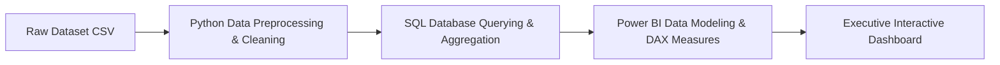

# 🎬  Netflix Global Market Analysis & Business Intelligence


---

## 📌 Executive Summary

This project delivers an end-to-end data analytics and business intelligence solution evaluating Netflix's global content library. By combining **Python exploratory data analysis (EDA)**, **SQL analytical querying**, and **interactive Power BI dashboards**, the project derives key content acquisition, genre distribution, and rating strategies for streaming decision-makers.

---

## ⚙️ Project Architecture & Workflow



---

## 💡 Key Insights & Business Highlights

- **🎥 Content Mix Ratios:** Analyzed the shift between Movie vs TV Show additions over time, showing strategic pivot  towards series retention.
- **🌍 Regional Production Hubs:** Identified top content-producing countries (US, India, UK) and regional genre preferences.
- **⏱️ Duration & Ratings Analysis:** Mapped content rating categories (TV-MA, TV-14, PG-13) against genre target demographics.
- **📊 Release Velocity:** Tracked annual growth rate of content additions to evaluate library expansion trends.

---

## 🛠️ Tech Stack & Analytical Methods

- **Data Wrangling:** Python (`Pandas`, `NumPy`)
- **Data Visualization:** Seaborn, Matplotlib, Power BI
- **SQL Analysis:** Aggregations, Window Functions, CTEs
- **BI & Modeling:** DAX measures, Custom Tooltips, Slicers, Star Schema

---

## 🚀 How to Run

1. **Clone the repository:**
   ```bash
   git clone https://github.com/sharvesh-analytics/Netflix_Market_Analysis.git
   ```
2. **Run Jupyter Notebook:**
   ```bash
   jupyter notebook
   ```
3. **Open Power BI Dashboard:**
   - Launch Power BI Desktop and open the `.pbix` dashboard file.

---

### 👤 Author
**Sharvesh Pandey** | [LinkedIn](https://www.linkedin.com/in/sharvesh-analytics) | [GitHub Profile](https://github.com/sharvesh-analytics)
